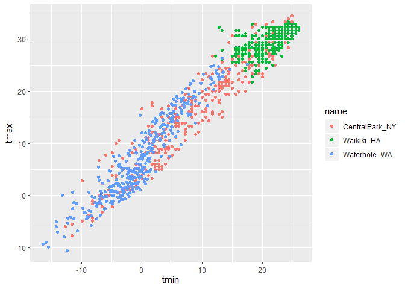

190926\_visiualization
================
Gavin Ko
9/26/2019

ggridges is a good plug in for ggplot that doesn’t overwrite anything
important and give it a little extra merits.

Here we are at VIS and EDA\!

## Create the weather data

``` r
weather_df = 
  rnoaa::meteo_pull_monitors(c("USW00094728", "USC00519397", "USS0023B17S"), #three sites
                      var = c("PRCP", "TMIN", "TMAX"), #humidity, minimumtemp, highesttemp
                      date_min = "2017-01-01",
                      date_max = "2017-12-31") %>%
  mutate(
    name = recode(id, USW00094728 = "CentralPark_NY", 
                      USC00519397 = "Waikiki_HA",
                      USS0023B17S = "Waterhole_WA"),
    tmin = tmin / 10,
    tmax = tmax / 10) %>%
  select(name, id, everything())
```

    ## Registered S3 method overwritten by 'crul':
    ##   method                 from
    ##   as.character.form_file httr

    ## Registered S3 method overwritten by 'hoardr':
    ##   method           from
    ##   print.cache_info httr

    ## file path:          C:\Users\good_\AppData\Local\rnoaa\rnoaa\Cache/ghcnd/USW00094728.dly

    ## file last updated:  2019-09-26 10:26:06

    ## file min/max dates: 1869-01-01 / 2019-09-30

    ## file path:          C:\Users\good_\AppData\Local\rnoaa\rnoaa\Cache/ghcnd/USC00519397.dly

    ## file last updated:  2019-09-26 10:26:22

    ## file min/max dates: 1965-01-01 / 2019-09-30

    ## file path:          C:\Users\good_\AppData\Local\rnoaa\rnoaa\Cache/ghcnd/USS0023B17S.dly

    ## file last updated:  2019-09-26 10:26:28

    ## file min/max dates: 1999-09-01 / 2019-09-30

``` r
weather_df
```

    ## # A tibble: 1,095 x 6
    ##    name           id          date        prcp  tmax  tmin
    ##    <chr>          <chr>       <date>     <dbl> <dbl> <dbl>
    ##  1 CentralPark_NY USW00094728 2017-01-01     0   8.9   4.4
    ##  2 CentralPark_NY USW00094728 2017-01-02    53   5     2.8
    ##  3 CentralPark_NY USW00094728 2017-01-03   147   6.1   3.9
    ##  4 CentralPark_NY USW00094728 2017-01-04     0  11.1   1.1
    ##  5 CentralPark_NY USW00094728 2017-01-05     0   1.1  -2.7
    ##  6 CentralPark_NY USW00094728 2017-01-06    13   0.6  -3.8
    ##  7 CentralPark_NY USW00094728 2017-01-07    81  -3.2  -6.6
    ##  8 CentralPark_NY USW00094728 2017-01-08     0  -3.8  -8.8
    ##  9 CentralPark_NY USW00094728 2017-01-09     0  -4.9  -9.9
    ## 10 CentralPark_NY USW00094728 2017-01-10     0   7.8  -6  
    ## # ... with 1,085 more rows

## Create a ggplot for that

Basic scatter plot is like this, which Jeff doesn’t use pretty
often.

``` r
ggplot(weather_df, aes(x = tmin, y = tmax, col = name)) + geom_point()
```

    ## Warning: Removed 15 rows containing missing values (geom_point).

<!-- -->

Alternative wat to make this plot with pipe, and filter

``` r
weather_df %>% 
  filter(name == "CentralPark_NY" | name == "Waikiki_HA") %>% 
    ggplot(aes(x = tmin, y = tmax) ) + 
    geom_point( aes(col = name), alpha = 0.4 ) +
    geom_smooth( aes(col = name), se = F )
```

    ## `geom_smooth()` using method = 'loess' and formula 'y ~ x'

    ## Warning: Removed 15 rows containing non-finite values (stat_smooth).

    ## Warning: Removed 15 rows containing missing values (geom_point).

<!-- -->

``` r
#alpha is to control the transparency of dots
#geom_smooth is to draw the trend of the general data
#se indicates not showing the gray bands
```

Facets

``` r
weather_df %>% 
  filter(name == "CentralPark_NY" | name == "Waikiki_HA") %>% 
    ggplot(aes(x = tmin, y = tmax) ) + 
    geom_point( aes(col = name), alpha = 0.4 ) +
    geom_smooth( aes(col = name), se = F ) + 
    facet_grid(. ~ name)
```

    ## `geom_smooth()` using method = 'loess' and formula 'y ~ x'

    ## Warning: Removed 15 rows containing non-finite values (stat_smooth).

    ## Warning: Removed 15 rows containing missing values (geom_point).

<!-- -->

Analysis according to dates

``` r
weather_df %>% 
  ggplot( aes(x = date, y = tmax, col = name) ) +
  geom_point(aes(size = prcp), alpha = 0.35) +
  geom_smooth(size = 2, se = F)
```

    ## `geom_smooth()` using method = 'loess' and formula 'y ~ x'

    ## Warning: Removed 3 rows containing non-finite values (stat_smooth).

    ## Warning: Removed 3 rows containing missing values (geom_point).

<!-- -->

``` r
#size indicates the size of point, and can be assigned with factors
```

You can remove any layer of geom, pick and choose what you want to show.

``` r
weather_df %>% 
  ggplot( aes(x = date, y = tmax, col = name) ) +
  geom_smooth(size = 2, se = F)
```

    ## `geom_smooth()` using method = 'loess' and formula 'y ~ x'

    ## Warning: Removed 3 rows containing non-finite values (stat_smooth).

<!-- -->

2D scatter plot

``` r
weather_df %>% 
  ggplot( aes(x = tmin, y = tmax, col = name) ) + 
  geom_bin2d() 
```

    ## Warning: Removed 15 rows containing non-finite values (stat_bin2d).

<!-- -->

``` r
#or geom_hex(), but you gotta install another package for this
```

\#\#More kinds of plots\!

``` r
weather_df %>% 
  ggplot(aes(x = tmax, fill = name)) + 
  geom_histogram(position = "dodge")
```

    ## `stat_bin()` using `bins = 30`. Pick better value with `binwidth`.

    ## Warning: Removed 3 rows containing non-finite values (stat_bin).

<!-- -->

``` r
#when you indicate col >> hollow, fill >> filled color
#position dodge is to make the histograms dodge eachother
```

``` r
weather_df %>% 
  ggplot(aes(x = tmax, fill = name)) + 
  geom_histogram() + 
  facet_grid(. ~ name)
```

    ## `stat_bin()` using `bins = 30`. Pick better value with `binwidth`.

    ## Warning: Removed 3 rows containing non-finite values (stat_bin).

<!-- -->

We can also put density plot, which shows a better distribution trend

``` r
weather_df %>% 
  ggplot(aes(x = tmax, fill = name)) + 
  geom_density(alpha = 0.3) 
```

    ## Warning: Removed 3 rows containing non-finite values (stat_density).

<!-- -->

What about boxplot?

``` r
weather_df %>% 
  ggplot(aes(x = name, y = tmax)) +
  geom_boxplot()
```

    ## Warning: Removed 3 rows containing non-finite values (stat_boxplot).

<!-- -->

Violin plot can be useful, sometimes. Can be used for data doublecheck.

``` r
weather_df %>% 
  ggplot(aes(x = name, y = tmax)) +
  geom_violin()
```

    ## Warning: Removed 3 rows containing non-finite values (stat_ydensity).

<!-- -->

Ridge plots? Useful for multiple group distribution. Once extremely
popular in 2017, only for 3 weeks.

``` r
weather_df %>% 
  ggplot(aes(x = tmax, y = name, fill = name)) +
  geom_density_ridges(alpha = 0.25)
```

    ## Picking joint bandwidth of 1.84

    ## Warning: Removed 3 rows containing non-finite values (stat_density_ridges).

<!-- -->

``` r
#Careful about the x and y assignment
```

Let’s try to save something.

``` r
weather_ridge = 
  weather_df %>% 
    ggplot(aes(x = tmax, y = name, fill = name)) +
    geom_density_ridges(alpha = 0.25)

ggsave("weather ridge plot.pdf", weather_ridge)
```

    ## Saving 7 x 5 in image

    ## Picking joint bandwidth of 1.84

    ## Warning: Removed 3 rows containing non-finite values (stat_density_ridges).

Also, adjust the size of the plots are allowed.

``` r
weather_df %>% 
  filter(name == "CentralPark_NY" | name == "Waikiki_HA") %>% 
    ggplot(aes(x = tmin, y = tmax) ) + 
    geom_point( aes(col = name), alpha = 0.4 ) +
    geom_smooth( aes(col = name), se = F ) 
```

    ## `geom_smooth()` using method = 'loess' and formula 'y ~ x'

    ## Warning: Removed 15 rows containing non-finite values (stat_smooth).

    ## Warning: Removed 15 rows containing missing values (geom_point).

<!-- -->

``` r
#assigned inside the {} big brackets
```
